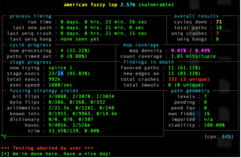
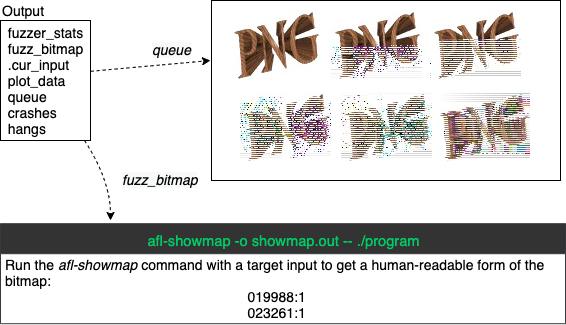
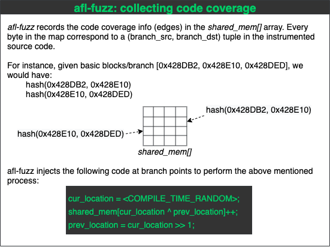
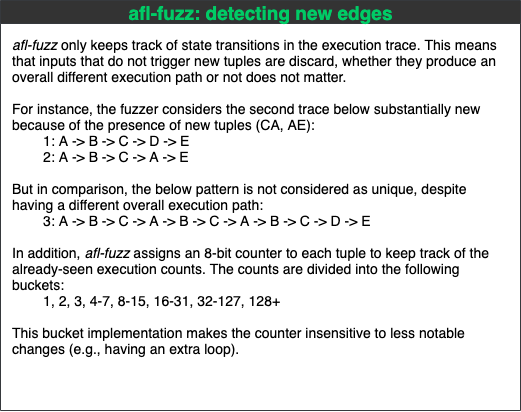
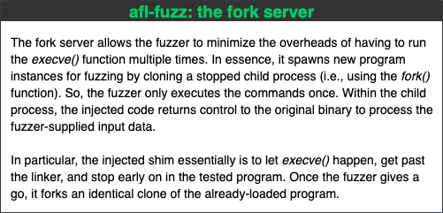
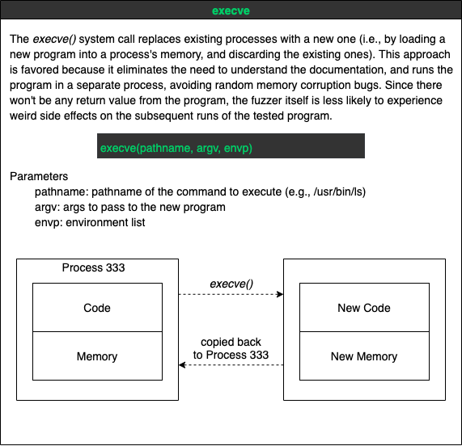

# Performance Fuzzer

The performance fuzzer is designed to identify performance hot spots. This fuzzer is built on top of AFL, which was originally developed by Michal Zalewski <lcamtuf@google.com>.

See [Refactoring Logs](docs/RecfactoringLogs.md) if you want to understand the implementation details. In section [](), we also present an overall on the core implementation.


## Installation & Fuzzing

Here is a general installation guide on the fuzzer. You should also check out our cheatsheet that summarizes the overall workflow of the fuzzer. The steps are the following:

1. Compile the fuzzer with `make`
2. Compile the `llvm` mode with `make`
3. Compile the program to be fuzzed using `afl-clang-fast`
4. Create initial tests
5. Run `afl-fuzz` on the tested program
6. Analyze the output

##### 1. Compile the fuzzer with `make`

```
$ make
```

##### 2. Compile the `llvm` mode with `make`

See [LLVM README](llvm_mode/README.llvm) for more details.

```
$ cd llvm && make
```

If the compilation is successful, this should generate a binary `afl-clang-fast` in the parent directory.

##### 3. Compile the program to be fuzzed using `afl-clang-fast`

The next step is to run to compile the program to be fuzzed from its source code. A common way is to assign the `CC` and `CXX` variables when running configure. This helps to select our compiled `afl-clang-fast` as the C compiler.

```
CC="/path_to_afl/afl-clang-fast" ./configure --disable-shared
make clean all
```

For C++ code, be sure to also include the `CXX` variable (e.g., `CXX="/path_to_afl/afl-clang-fast++"`).

##### 4. Create initial tests

Setup a basic input file as a starting point for the fuzzer. This input file will serve as seed to the program. Make sure the program will accept this input as a valid parameter.

##### 5. Run `afl-fuzz` on the tested program

For programs that reads from stdin, run `afl-fuzz` as following:

```
/path_to_afl/afl-fuzz -p -i ./seeds -o seeds_out -- ./path_to_program [program cmdline]
```

For programs that take input from a file, you can use the `@@` annotation. This will automatically replace it by the content of the file from the test case directory (i.e., `./seeds` in our example below).

```
/path_to_afl/afl-fuzz -p -i ./seeds -o seeds_out -- ./path_to_program @@
```

See [Workflow](#workflow) for more details on how afl-fuzz is implemented.

##### 6. Analyze the output

<p align="center">
	
</p>

<p align="center">
	
</p>


## <a name="workflow"></a>Workflow

Below, we summarize in form of cheatsheet the core components that are essential for understanding the workflow in `afl-fuzz`.

##### 1. Collecting code coverage

<p align="center">
	
</p>

##### 2. Detecting new edges

<p align="center">
	
</p>

##### 3. On the implementation of the fork server

<p align="center">
	
</p>

<p align="center">
	
</p>
